# TaskFlow

TaskFlow는 사내 업무관리, 일정관리, 보고관리, 경비지출, 공지사항, 자료실, 알림, 파일 업로드를 제공하는 업무관리 시스템입니다.

- Backend: `taskflow-api` Django REST API
- Frontend: `taskflow-web` Next.js 웹앱

## 프로젝트 구조

```text
TaskFlow/
├── taskflow-api/   # Django, DRF, PostgreSQL 기반 백엔드
└── taskflow-web/   # Next.js, React 기반 프론트엔드
```

### 백엔드 파일 구조

```text
taskflow-api/
├── manage.py
├── pyproject.toml
├── config/
│   ├── asgi.py
│   ├── urls.py
│   ├── wsgi.py
│   └── settings/
│       ├── base.py
│       ├── local.py
│       ├── dev.py
│       ├── prod.py
│       └── test.py
└── apps/
    ├── common/          # 공통 모델, 권한, 응답, 유틸
    ├── users/           # 사용자, 프로필, 권한, 인증, 생체인식
    ├── work_requests/   # 업무요청, 댓글, 첨부파일
    ├── todos/           # 개인 할 일, 체크리스트
    ├── schedules/       # 공유 일정, 캘린더, Google Calendar 구독
    ├── reports/         # 업무보고, 경비지출, 첨부, PDF/Excel
    ├── boards/          # 게시판, 공지, 자료실, 댓글, 좋아요
    ├── notifications/   # 알림, 알림 설정, SSE
    └── media_files/     # 공통 파일 업로드/다운로드, 비동기 작업 로그
```

각 Django 앱은 대체로 아래 구조를 따릅니다.

```text
apps/{app_name}/
├── models.py       # 데이터 모델
├── serializers.py  # 요청/응답 검증과 변환
├── views.py        # API 로직과 권한 처리
├── urls.py         # URL 라우팅
├── tests.py        # API/모델 테스트
└── migrations/     # DB 마이그레이션
```

### 프론트엔드 파일 구조

```text
taskflow-web/
├── package.json
├── next.config.js
├── tsconfig.json
├── public/
├── src/
│   ├── components/
│   │   ├── AppShell.tsx  # 공통 레이아웃, 사이드바, 사용설명서, 권한별 메뉴
│   │   └── Logo.tsx
│   ├── contexts/
│   │   └── AuthContext.tsx  # 로그인 상태, 토큰 저장/갱신
│   ├── lib/
│   │   ├── api.ts       # 백엔드 API 호출, 업로드, 다운로드
│   │   ├── format.ts    # 날짜/금액 포맷
│   │   ├── labels.ts    # 상태/구분 라벨
│   │   ├── releaseNotes.ts # 릴리즈노트 데이터
│   │   └── webauthn.ts  # 생체인식 브라우저 처리
│   ├── pages/
│   │   ├── _app.tsx
│   │   ├── _document.tsx
│   │   ├── index.tsx
│   │   ├── login.tsx
│   │   ├── register.tsx
│   │   ├── reset-password.tsx
│   │   ├── dashboard.tsx
│   │   ├── tasks.tsx
│   │   ├── work-requests.tsx
│   │   ├── todos.tsx
│   │   ├── schedules.tsx
│   │   ├── reports.tsx
│   │   ├── expenses.tsx
│   │   ├── boards.tsx
│   │   ├── data-room.tsx
│   │   ├── notifications.tsx
│   │   ├── profile.tsx
│   │   ├── release-notes.tsx
│   │   └── admin/
│   │       └── users.tsx
│   └── styles/
│       └── globals.css  # 공통 UI와 반응형 스타일
└── .eslintrc.json
```

`node_modules/`, `.next/`, `out/`, `.venv/`, `__pycache__/`는 설치/빌드/캐시 산출물이므로 README 구조도에서는 제외합니다.

## 백엔드

### 기술 스택

| 구분 | 내용 |
| --- | --- |
| Runtime | Python 3.13 |
| Framework | Django, Django REST Framework |
| Auth | JWT, SimpleJWT, dj-rest-auth, django-allauth |
| DB | PostgreSQL |
| Realtime | Channels, Daphne, SSE 알림 스트림 |
| Async | Celery, django-celery-beat, Redis |
| Files | 공통 파일 업로드/다운로드, PDF/Excel 처리 |
| API Docs | drf-spectacular, Swagger UI |

### 주요 앱

| 앱 | 역할 |
| --- | --- |
| `apps.users` | 회원가입, 로그인, JWT, 프로필, 권한, 관리자 승격, 생체인식 |
| `apps.work_requests` | 업무요청, 다중 담당자, 댓글, 첨부파일 |
| `apps.todos` | 개인 할 일, 체크리스트, 마감일 |
| `apps.schedules` | 공유 일정, Google Calendar 구독, 통합 캘린더 |
| `apps.reports` | 업무보고, 수신자 확인/보완요청, 첨부파일, 경비지출 |
| `apps.boards` | 게시판, 공지, 자료실, 댓글, 첨부파일 |
| `apps.notifications` | 알림 목록, 읽음 처리, SSE 스트림 |
| `apps.media_files` | 공통 파일 업로드/다운로드, 비동기 작업 로그 |

### 모델 관계 요약

| 중심 모델 | 주요 관계 |
| --- | --- |
| `User` | `Profile`, `NotificationSetting`과 1:1, 업무요청/보고서/일정/게시글의 작성자 또는 수신자 |
| `Profile` | `User` 1:1 프로필 확장 정보 |
| `AdminApprovalRequest` | 일반 사용자의 관리자 승격 신청, `reviewed_by`는 처리한 CEO |
| `BiometricCredential` | `User` 1:N 생체인식/패스키 인증 정보 |
| `WorkRequest` | `requester` 1명, 대표 `assignee` 1명, 다중 `assignees` M:N |
| `WorkRequestComment` | `WorkRequest` 1:N 댓글, `author`는 작성자 |
| `WorkRequestFile` | `WorkRequest`와 `MediaFile` 연결 첨부파일 |
| `Todo` | `User` 1:N 개인 할 일 |
| `TodoItem` | `Todo` 1:N 체크리스트 |
| `Schedule` | `created_by` 작성자, `ScheduleParticipant`로 참여자 관리 |
| `ScheduleParticipant` | `Schedule`과 `User` 사이의 참석 상태 연결 |
| `Report` | `writer`, `approver`, `recipients` M:N 수신자 관계 |
| `ReportRecipient` | 보고서 수신자별 읽음/확인완료/보완요청 상태 |
| `ExpenseItem` | 경비지출 `Report` 1:N 지출 항목 |
| `ExpenseReceipt` | `ExpenseItem`과 `MediaFile` 연결 영수증 |
| `ReportFile` | `Report`와 `MediaFile` 연결 일반 첨부파일 |
| `BoardPost` | `author` 작성자, `specific_users` M:N 열람 대상 |
| `BoardComment` | `BoardPost` 1:N 댓글, `parent`로 대댓글 가능 |
| `BoardLike` | `BoardPost`와 `User` 좋아요 중복 방지 |
| `BoardFile` | `BoardPost`와 `MediaFile` 연결 첨부파일 |
| `Notification` | `User` 1:N 알림, `target_type/target_id`로 원본 도메인 참조 |
| `MediaFile` | 실제 파일 메타데이터, 여러 도메인의 연결 모델이 참조 |
| `AsyncTaskLog` | PDF/Excel/파일 작업 상태와 결과 파일 기록 |

### ERD

Mermaid를 지원하는 Markdown 뷰어에서 아래 ERD를 확인할 수 있습니다.

```mermaid
erDiagram
  USER ||--|| PROFILE : has
  USER ||--o| NOTIFICATION_SETTING : has
  USER ||--o{ ADMIN_APPROVAL_REQUEST : applies
  USER ||--o{ ADMIN_APPROVAL_REQUEST : reviews
  USER ||--o{ BIOMETRIC_CREDENTIAL : owns
  USER ||--o{ MEDIA_FILE : uploads
  USER ||--o{ NOTIFICATION : receives

  USER ||--o{ WORK_REQUEST : requests
  USER ||--o{ WORK_REQUEST : assigned_primary
  USER }o--o{ WORK_REQUEST : assigned_many
  WORK_REQUEST ||--o{ WORK_REQUEST_COMMENT : has
  USER ||--o{ WORK_REQUEST_COMMENT : writes
  WORK_REQUEST ||--o{ WORK_REQUEST_FILE : has
  MEDIA_FILE ||--o{ WORK_REQUEST_FILE : linked

  USER ||--o{ TODO : owns
  TODO ||--o{ TODO_ITEM : has

  USER ||--o{ SCHEDULE : creates
  SCHEDULE ||--o{ SCHEDULE_PARTICIPANT : has
  USER ||--o{ SCHEDULE_PARTICIPANT : participates

  USER ||--o{ REPORT : writes
  USER ||--o{ REPORT : approves
  USER }o--o{ REPORT : receives
  REPORT ||--o{ REPORT_RECIPIENT : tracks
  USER ||--o{ REPORT_RECIPIENT : recipient
  REPORT ||--o{ EXPENSE_ITEM : has
  EXPENSE_ITEM ||--o{ EXPENSE_RECEIPT : has
  MEDIA_FILE ||--o{ EXPENSE_RECEIPT : linked
  REPORT ||--o{ REPORT_FILE : has
  MEDIA_FILE ||--o{ REPORT_FILE : linked

  USER ||--o{ BOARD_POST : writes
  USER }o--o{ BOARD_POST : permitted
  BOARD_POST ||--o{ BOARD_COMMENT : has
  USER ||--o{ BOARD_COMMENT : writes
  BOARD_COMMENT ||--o{ BOARD_COMMENT : replies
  BOARD_POST ||--o{ BOARD_LIKE : has
  USER ||--o{ BOARD_LIKE : likes
  BOARD_POST ||--o{ BOARD_FILE : has
  MEDIA_FILE ||--o{ BOARD_FILE : linked

  MEDIA_FILE ||--o{ ASYNC_TASK_LOG : result
```



### 백엔드 실행

```bash
cd taskflow-api
source .venv/bin/activate
python manage.py migrate
python manage.py runserver
```

API 문서:

- Swagger UI: `http://127.0.0.1:8000/swagger-ui/`
- OpenAPI schema: `http://127.0.0.1:8000/api/schema/`

### 백엔드 환경 변수 예시

```env
DEBUG=True
SECRET_KEY=change-me
ALLOWED_HOSTS=localhost,127.0.0.1,0.0.0.0

POSTGRES_DB=taskflow_db
POSTGRES_USER=postgres
POSTGRES_PASSWORD=postgres
DB_HOST=127.0.0.1
DB_PORT=5432

REDIS_URL=redis://127.0.0.1:6379/0
MEDIA_URL=/media/
FRONTEND_URL=http://localhost:3000
CORS_ALLOWED_ORIGINS=http://localhost:3000,http://127.0.0.1:3000
CSRF_TRUSTED_ORIGINS=http://localhost:3000,http://127.0.0.1:3000
```

### 백엔드 테스트

```bash
cd taskflow-api
source .venv/bin/activate
python manage.py test apps.users apps.work_requests apps.todos apps.schedules apps.notifications apps.media_files apps.boards apps.reports
```

빠른 확인:

```bash
python manage.py test apps.users apps.work_requests apps.schedules apps.reports
```

## 프론트엔드

### 기술 스택

| 구분 | 내용 |
| --- | --- |
| Runtime | Node.js |
| Framework | Next.js 14, React 18 |
| Language | TypeScript |
| Styling | 전역 CSS, 반응형 레이아웃 |
| API Client | `src/lib/api.ts` |
| Auth State | `src/contexts/AuthContext.tsx` |

### 프론트엔드 실행

개발 서버:

```bash
cd taskflow-web
npm install
npm run dev
```

브라우저:

```text
http://localhost:3000
```

운영 빌드 실행:

```bash
cd taskflow-web
npm run build
npm run start
```

주의: `npm run baild`가 아니라 `npm run build`입니다.

### 프론트엔드 주요 파일

| 파일 | 역할 |
| --- | --- |
| `src/lib/api.ts` | 백엔드 API 호출, 업로드, 다운로드, 오류 처리 |
| `src/contexts/AuthContext.tsx` | 로그인 상태, 토큰 저장/갱신 |
| `src/components/AppShell.tsx` | 공통 레이아웃, 사이드바, Quick Menu, 사용설명서, 권한별 메뉴 |
| `src/pages/tasks.tsx` | 업무요청과 체크리스트를 통합한 업무관리 화면 |
| `src/pages/work-requests.tsx` | 업무요청 단독 화면 |
| `src/pages/todos.tsx` | 내 할 일 단독 화면 |
| `src/pages/schedules.tsx` | 일정관리, 캘린더 보기, 일정 등록/수정, Google Calendar 구독 |
| `src/pages/reports.tsx` | 보고관리, 업무보고/경비지출 작성, 관리자 처리 |
| `src/pages/expenses.tsx` | 경비지출 작성/검토 단독 화면 |
| `src/pages/boards.tsx` | 공지사항 등록/목록 |
| `src/pages/data-room.tsx` | 자료실 등록/목록 |
| `src/pages/release-notes.tsx` | 릴리즈노트 전체 내역 |
| `src/pages/admin/users.tsx` | 계정관리 |
| `src/styles/globals.css` | 공통 UI, 카드/테이블/폼/반응형 스타일 |

### 개발 규칙

- 사용자에게 보이는 기능을 추가하거나 기존 기능의 동작/화면을 변경하면 `taskflow-web/src/lib/releaseNotes.ts`에 릴리즈노트를 함께 기록합니다.
- 릴리즈노트는 최신 항목이 위로 오도록 추가하고, `date`, `title`, `summary`, `details`를 모두 작성합니다.
- `summary`는 목록에서 빠르게 읽히도록 짧게 쓰고, 구체적인 변경 내용은 `details`에 항목별로 정리합니다.
- 단순 오타 수정, 내부 리팩터링, 테스트만 변경한 경우처럼 사용자 화면이나 사용 흐름이 바뀌지 않는 작업은 릴리즈노트 생략이 가능합니다.

### 프론트엔드 검증

```bash
cd taskflow-web
npm run lint
npm run build
```

## 권한 정책

| 권한 | 설명 |
| --- | --- |
| `USER` | 일반 사용자, 업무관리/일정/보고/공지사항/자료실 사용 |
| `ADMIN` | 관리자, 일반 업무 기능과 일부 관리 기능 사용 |
| `CEO` | 대표이사, 보고서 작성은 비활성화하고 받은 보고서 확인 중심 |
| `SUPERUSER` | 계정관리 전용, 프론트에서는 계정관리 화면만 노출 |

직함 `대표이사`는 표시용이고 실제 권한은 `role=CEO` 기준입니다.

## 대표 기능

### 업무관리

- 업무요청과 체크리스트 통합 목록
- 업무 등록 버튼으로 업무요청 또는 체크리스트 등록
- 받은 요청, 보낸 요청, 체크리스트, 진행중, 완료 탭 제공
- 제목 클릭 시 상세 내용 확인
- 담당자 이름, 부서, 직함 표시
- 업무 상태 변경과 완료 처리

### 일정관리

- 전체 사용자 일정이 보이는 공유 일정 달력
- 년/월/주/일 보기
- 하단 목록에는 내가 등록한 일정 표시
- 날짜 더블클릭으로 새 일정 등록
- 시작일 필수, 종료일 선택사항
- 종일/기간 일정과 24시간 직접 입력 방식 지원
- Google Calendar 구독 URL 접기/펼치기

### 보고관리

- 업무보고 작성/수정/제출/재제출
- 경비지출 보고 작성
- 수신자 카드 검색과 수기 입력 통합
- 수신자별 읽음/확인완료/보완요청 상태 표시
- 내용 아래 파일 첨부
- 보낸 보고서/받은 보고서 분리
- 보고서 상세에서 연결된 경비지출 항목 확인
- 관리자와 대표이사는 처리대기, 경비 승인대기, 정산중 현황 확인
- 관리자와 대표이사는 부서별, 작성자별 필터로 보고서와 경비지출 조회
- 대표이사는 작성/보낸 보고서 UI 숨김, 받은 보고서 중심

### 경비지출

- 경비지출 보고 작성
- 경비 항목 등록
- 영수증 첨부
- 승인/반려 후 정산중, 정산완료 처리
- 여러 경비지출 건 일괄 상태 변경
- 이번 달, 전체, 월별 받을 금액/정산금액 요약
- PDF/Excel 생성 API 기반

### 공지사항/자료실/알림

- 공지사항 등록과 대시보드 공지사항 패널
- 자료실 게시글 등록과 권한별 공개 설정
- 댓글, 좋아요, 첨부파일
- 알림 목록, 읽음 처리, SSE 실시간 알림

## 대표 API

| 영역 | Endpoint |
| --- | --- |
| 로그인 | `POST /api/users/login/` |
| 내 정보 | `GET/PATCH /api/users/me/` |
| 계정관리 | `GET /api/users/admin/users/` |
| 업무요청 | `GET/POST /api/work-requests/` |
| 할 일 | `GET/POST /api/todos/` |
| 일정 | `GET/POST /api/schedules/` |
| Google Calendar 구독 | `GET /api/schedules/google-calendar-subscription/` |
| 업무보고 | `GET/POST /api/reports/` |
| 보고서 첨부 | `GET/POST /api/reports/{id}/files/` |
| 경비지출 | `GET /api/reports/expenses/` |
| 경비지출 요약 | `GET /api/reports/expenses/summary/` |
| 경비지출 일괄 상태 변경 | `POST /api/reports/expenses/bulk-status/` |
| 공지사항/자료실 | `GET/POST /api/boards/posts/` |
| 알림 | `GET /api/notifications/` |
| 파일 업로드 | `POST /api/media/files/` |

## 실행 순서 요약

터미널 1, 백엔드:

```bash
cd taskflow-api
source .venv/bin/activate
python manage.py migrate
python manage.py runserver
```

터미널 2, 프론트엔드:

```bash
cd taskflow-web
npm run dev
```

운영 모드 확인:

```bash
cd taskflow-web
npm run build
npm run start
```
